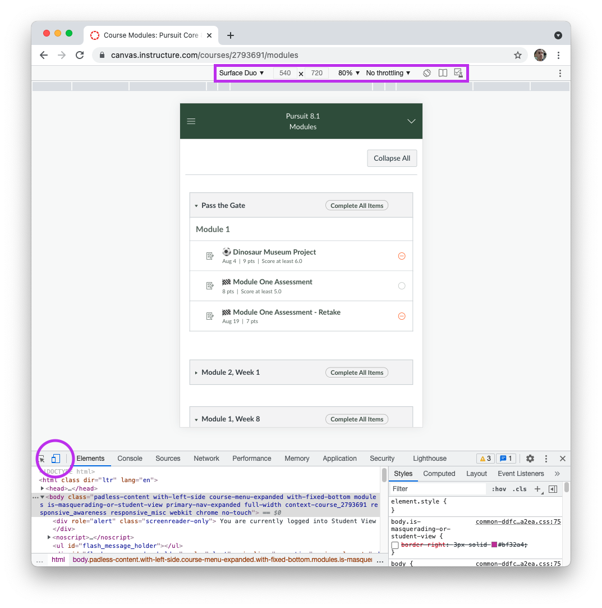

# Media Queries

While many of the most popular technology companies have both a website and an application, many users will attempt to access the website via their mobile browser. It is important for websites to be able to be responsive to all types of device sizes.

In this lesson, you'll learn more about what is meant by responsive design. You'll also begin to implement responsive design through the use of media queries.

## Learning Objectives

By the end of this lesson you should be able to:

- Describe what is meant by responsive design.
- Modify the layout of a page with media queries so that it displays differently depending on the screen size.

---

## What is responsive design?

These days there are more screens than ever. From desktop, to laptop, to tablet, to phone, each of these screens are sized differently. As a web developer, you'll need to keep in mind that your user may not be using the same screen you are when designing a website. This means that what may look spacious and large on your screen could become cramped and unreadable on a different screen.

Responsive design refers to the idea that when designing a website, you should design it so that it can adapt and change based on the screen size. This can be done with CSS through the use of media queries.

### Chrome's device toolbar

In general, you can test how responsive a website is by changing the size of your browser's window. Many popular websites will have at least some slight variation between the largest and smallest sizes you can get.

However, Chrome has a built-in tool that makes it easy to test a website at various sizes. To do so, you'll first want to open up the Developer Tools which can be done by pressing `Command` + `Option` + `i`. Then, you can click on the small icon that shows two screens next to one another.



Once enabled, the device toolbar will show at the top of the screen. This will allow you to quickly select different screen sizes from popular devices or set your own screen size.

## Media queries

Media queries are a special tool that can be used within CSS to allow you to write CSS that will only apply on certain screens or screen sizes.

To use media queries, you must first set up the viewport for the page, described below. Then, you can add CSS rules which will only get applied under certain conditions.

### Setting the viewport

To allow for media queries to work appropriately on your page, you must first add the following to the `head` element of your HTML page.

```html
<meta name="viewport" content="width=device-width, initial-scale=1.0" />
```

The element above allows your page to take into account the screen size and respond accordingly. While there are other possible values for the `content` property, they are not too important as you get started.

If you'd like, you can read more about the viewport meta tag.

- [MDN: Viewport meta tag](https://developer.mozilla.org/en-US/docs/Web/HTML/Viewport_meta_tag)

### Overwriting styles within media queries

Take a look at the following CSS which includes a media query. The CSS is explained below, but make a guess as to what this query might do before reading further.

You can also make use of the repl, included below.

```css
p {
  color: darkred;
}

@media (min-width: 750px) {
  p {
    color: lightslategray;
  }
}
```

- [Repl.it: Responsive Example](https://replit.com/@Pursuit/Media-Queries-Responsive-Example)

Media queries start with `@media` and are followed by some kind of condition. Within the curly braces are additional CSS rules that will get applied if the condition is met.

In the above example, all of the rules inside of the media query will be applied if the width of the page is 750px or more. This means that, once the screen is 750px wide or more, the `p` rule inside of the media query will overwrite the earlier `p` rule.

In general, this is how media queries work: you write your CSS for one size of screen and then write additional rules that lay on top of those styles, for when the screen size changes.

### Common setup

Typically you will either design a website as "mobile-first" or "desktop-first". Mobile-first means that your general design (i.e. everything outside of the media queries) is focused on a small screen size, whereas desktop-first would focus on a larger screen size.

#### Mobile first

If you choose to write code mobile-first, your CSS will look something like the CSS below. This allows you to write your CSS for styling small devices at the very top and then make adjustments as the screen size increases.

```css
/* 
  All rules above the @media queries apply to devices from 0px to 767px wide (inclusive)
*/

@media (min-width: 768px) {
  /* Rules here apply to devices from from 768px to 991px (inclusive) */
}

@media (min-width: 992px) {
  /* Rules here apply to devices from 992px to 1199px (inclusive) */
}

@media (min-width: 1200px) {
  /* Rules here apply to devices 1200px and greater */
}
```

#### Desktop first

If you choose to write code desktop-first, your CSS will look something like the CSS below. This allows you to write your CSS for styling large devices at the very top and then make adjustments as the screen size decreases.

```css
/* 
  All rules above the @media queries apply to devices 1201px wide and greater (inclusive)
*/

@media (max-width: 1200px) {
  /* Rules here apply to devices 1200px and greater */
}

@media (max-width: 992px) {
  /* Rules here apply to devices from 992px to 1199px (inclusive) */
}

@media (max-width: 768px) {
  /* Rules here apply to devices from from 768px to 991px (inclusive) */
}
```
